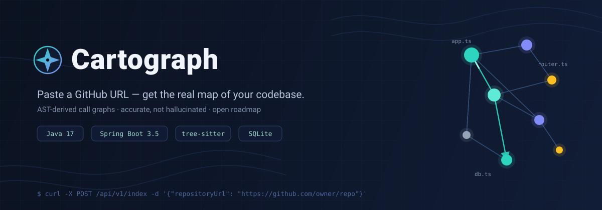
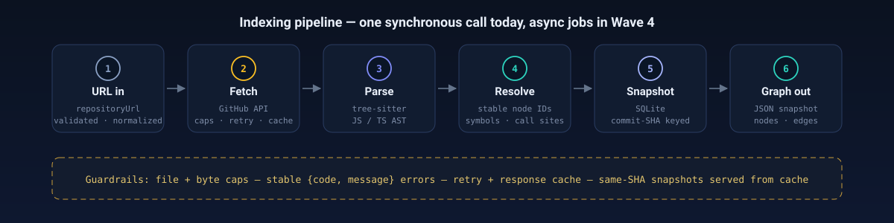
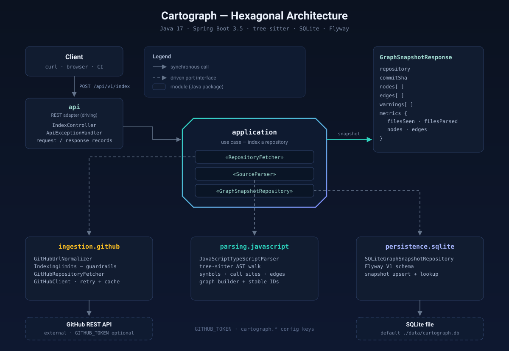

<div align="center">



**Real call graphs for any repository — accurate, not hallucinated.**
Paste a GitHub URL, get an AST-derived map of how the code actually connects.

[](https://github.com/pacman-cli/Cartograph/actions/workflows/ci.yml)
[](LICENSE)
[](https://openjdk.java.net/projects/jdk/17/)
[](https://spring.io/projects/spring-boot)
[](https://github.com/pacman-cli/Cartograph/stargazers)
[](https://github.com/pacman-cli/Cartograph/graphs/contributors)
[](CONTRIBUTING.md)
[](CONTRIBUTING.md)

[Quickstart](#-quickstart) · [How it works](#-how-it-works) · [Architecture](#️-architecture) · [Roadmap](#-roadmap) · [Contributing](#-contributing)

</div>

---

## 🗺️ Why Cartograph?

AI assistants guess how your codebase connects — and they hallucinate call graphs that look right but aren't. Cartograph doesn't guess. It **fetches your repository, parses it with [tree-sitter](https://tree-sitter.github.io/tree-sitter/), and builds a real graph** from the source: every node and edge traceable to actual code.

- **Paste a URL, get a map.** One `POST /api/v1/index` call turns `github.com/owner/repo` into a structured graph snapshot.
- **AST-accurate, not LLM-hallucinated.** Symbols, call sites, and edges are extracted by deterministic parsers, with warnings when coverage is incomplete.
- **Snapshots, not re-fetches.** Results are persisted in SQLite, keyed by commit SHA — the same commit returns the same cached graph.
- **Guardrails built in.** Repository size caps, stable error contracts, retry with response caching — so a 10k-file monorepo can't take the service down.
- **An honest, open roadmap.** 90+ planned features tracked wave by wave in public. We're at the beginning — perfect time to join.

> **Status:** backend walking skeleton on `main` — 63 tests green, and the first live index of a public repository already works (`sindresorhus/is` → 242 nodes, 487 edges). In flight: GitHub client resilience — bounded retries, timeouts, ETag reuse, SHA-pinned fetches (feature F0.08). The graph viewer UI and async jobs are the next waves. See [Roadmap](#-roadmap).

## ⚡ Quickstart

**Prerequisites:** Java 17 and Maven. No database to install, no API key required (set `GITHUB_TOKEN` only if you hit GitHub rate limits).

```bash
# 1. Clone and start the API
git clone https://github.com/pacman-cli/Cartograph.git
cd Cartograph
mvn spring-boot:run
```

```bash
# 2. Index any public GitHub repository
curl -X POST http://localhost:8080/api/v1/index \
  -H 'Content-Type: application/json' \
  -d '{"repositoryUrl":"https://github.com/sindresorhus/is"}'
```

```jsonc
// 3. Get back a graph snapshot
{
  "repository": "github.com/sindresorhus/is",
  "commitSha": "e1f4a2b…",
  "nodes": [ { "id": "…", "kind": "FUNCTION", "location": { } }, "… 242 total" ],
  "edges": [ "… 487 call edges" ],
  "warnings": [ "… files skipped or partially parsed" ],
  "metrics": { "filesSeen": 19, "filesParsed": 5, "nodes": 242, "edges": 487 }
}
```

Run the full offline test suite (no network needed):

```bash
mvn test
```

<details>
<summary><b>macOS with Homebrew OpenJDK</b> (click to expand)</summary>

```bash
export JAVA_HOME=/opt/homebrew/opt/openjdk@17/libexec/openjdk.jdk/Contents/Home
export PATH="$JAVA_HOME/bin:/opt/homebrew/bin:$PATH"
mvn spring-boot:run
```
</details>

<details>
<summary><b>Configuration</b> (all optional)</summary>

| Key | Default | What it does |
|---|---|---|
| `tracemap.sqlite.path` | `./data/tracemap.db` | Where graph snapshots are persisted |
| `tracemap.github.token` | — (env: `GITHUB_TOKEN`) | GitHub token; raises API rate limits |
| `tracemap.github.max-files` | `10000` | Max files indexed per repository |
| `tracemap.github.max-total-bytes` | `1073741824` (1 GiB) | Max total repository bytes |
| `tracemap.github.max-file-bytes` | `10485760` (10 MiB) | Max single-file bytes |
| `tracemap.github.max-response-bytes` | `33554432` (32 MiB) | Max GitHub API response bytes |
| `server.port` | `8080` | HTTP port |

Set properties via `src/main/resources/application.yml`, command line (`--tracemap.sqlite.path=…`), or environment variables.
</details>

## 📡 API

### `POST /api/v1/index`

Indexes (or returns the cached snapshot for) a public GitHub repository.

```json
{ "repositoryUrl": "https://github.com/<owner>/<repo>" }
```

Every error uses a stable `{ "code": "...", "message": "..." }` body:

| HTTP | Code | Meaning |
|---|---|---|
| 400 | `INVALID_REQUEST` | Invalid JSON, blank URL, or not a GitHub URL |
| 404 | `NOT_FOUND` | Unknown local route |
| 404 | `UPSTREAM_GITHUB_ERROR` | GitHub repository or resource not found |
| 403 | `UPSTREAM_GITHUB_ERROR` | GitHub denied access |
| 413 | `REPOSITORY_LIMIT_EXCEEDED` | Repository exceeds configured caps |
| 429 | `UPSTREAM_GITHUB_ERROR` | GitHub rate limit hit (set `GITHUB_TOKEN`) |
| 502 | `UPSTREAM_GITHUB_ERROR` | GitHub returned an unusable response |
| 500 | `INTERNAL_ERROR` | Unexpected server failure |

## 🔭 How it works



1. **URL in** — the GitHub URL is validated and normalized (`owner/repo` only in v1; branches and subpaths are rejected).
2. **Fetch** — the repository tree and sources are pulled from the GitHub API inside hard size caps, with retry and response caching.
3. **Parse** — tree-sitter walks each JS/TS/TSX file into an AST.
4. **Resolve** — symbols and call sites are extracted and normalized into stable node IDs.
5. **Snapshot** — the graph is persisted to SQLite, keyed by commit SHA.
6. **Graph out** — the same snapshot is returned for the same commit; a new commit triggers a fresh index.

## 🏗️ Architecture

Cartograph is a hexagonal (ports & adapters) Spring Boot service — the core use case has zero framework knowledge; everything is an adapter behind a port.



| Module | Role |
|---|---|
| `api` | REST adapter — request validation, response mapping, stable error handler |
| `application` | The use case + **ports**: `RepositoryFetcher`, `SourceParser`, `GraphSnapshotRepository` |
| `ingestion` | URL normalization, indexing guardrails, GitHub client (retry + cache) |
| `parsing` | tree-sitter JS/TS/TSX extractor |
| `graph` | Domain model (nodes, edges, metrics, warnings), `GraphBuilder`, stable IDs |
| `persistence` | SQLite snapshot store + schema migrations |

```
src/main/java/com/tracemap/
├── api/            # REST adapter
├── application/    # use case + ports (pure domain)
├── ingestion/      # GitHub ingestion adapters + guardrails
├── parsing/        # tree-sitter language extractors
├── graph/          # domain model + graph builder
└── persistence/    # SQLite adapter + migrations
```

## 🧭 Roadmap

Development is organized into waves — each wave ends in a runnable demo. Detailed specs live in [`tracemap-execution-plan.md`](tracemap-execution-plan.md); per-feature status in [`tracemap-feature-tracker.csv`](tracemap-feature-tracker.csv).

| Wave | Focus | Status |
|---|---|---|
| W0–W2 | Foundation, ingestion, parser, graph store → **walking skeleton** | 🟡 In progress — backend merged, tests green |
| W3–W5 | Symbol resolution, confidence scoring, async jobs, caching | ⬜ Next |
| W4–W6 | **Graph viewer UI** (React Flow), sharing, permalinks, landing page | ⬜ |
| W7–W8 | Ask/chat (grounded answers), deploy pipeline, rate limiting | ⬜ |
| W9–W11 | Trace engine (click-to-trace paths), launch kit | ⬜ |
| Gate C+ | Phase 2: auth, multi-repo workspaces, cross-service stitching, Neo4j | 🔒 Gated |
| Gate D+ | Phase 3: IDE extensions, self-host bundle, hosted SaaS | 🔒 Gated |

> v1 deliberately excludes Kafka, multi-agent orchestration, and Neo4j — they're behind metric gates, not hype.

## 🤝 Contributing

Contributions are **warmly welcome** — the roadmap is wave-by-wave and every wave contains `good first issue` sized work. Hacktoberfest participants: yes, we're participating! 🎃

1. Browse [good first issues](https://github.com/pacman-cli/Cartograph/issues?q=is%3Aissue+is%3Aopen+label%3A%22good+first+issue%22) or [`help wanted`](https://github.com/pacman-cli/Cartograph/issues?q=is%3Aissue+is%3Aopen+label%3A%22help+wanted%22)
2. Read [CONTRIBUTING.md](CONTRIBUTING.md) — env setup, branch & commit conventions, PR checklist
3. Fork → branch → `mvn test` → open a PR against `main`

Not a coder? Star ⭐ the repo, try it on your favorite repository and [report what broke](https://github.com/pacman-cli/Cartograph/issues/new?template=bug_report.yml), or improve the docs.

## 💙 Community

- 💬 Questions & ideas → [Discussions](https://github.com/pacman-cli/Cartograph/discussions)
- ⭐ If Cartograph looks useful, a star genuinely helps others find it
- 📣 Building something with it? Open a discussion — we'll feature it

<a href="https://star-history.com/#pacman-cli/Cartograph&Date">
 <picture>
   <source media="(prefers-color-scheme: dark)" srcset="https://api.star-history.com/svg?repos=pacman-cli/Cartograph&type=Date&theme=dark" />
   <source media="(prefers-color-scheme: light)" srcset="https://api.star-history.com/svg?repos=pacman-cli/Cartograph&type=Date" />
   
 </picture>
</a>

## 📚 Go deeper

| If you want to know… | Read |
|---|---|
| Strategy, positioning, architecture decisions | [`tracemap-architecture-and-implementation-plan.md`](tracemap-architecture-and-implementation-plan.md) |
| All 90+ features with acceptance criteria | [`tracemap-detailed-implementation-plan.md`](tracemap-detailed-implementation-plan.md) |
| Wave sequencing and cut lines | [`tracemap-execution-plan.md`](tracemap-execution-plan.md) |
| Machine-readable feature status | [`tracemap-feature-tracker.csv`](tracemap-feature-tracker.csv) |
| Ground rules for AI coding agents | [`AGENTS.md`](AGENTS.md) |

## 📄 License

[MIT](LICENSE) © Cartograph contributors
