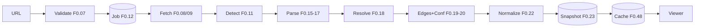

# Cartograph — Execution Plan v2.0
### Situation analysis → build-wave schedule → deep specs

> **Doc 3 of 3.** [`cartograph-architecture-and-implementation-plan.md`](./cartograph-architecture-and-implementation-plan.md) = strategy (the "what & why").
> [`cartograph-detailed-implementation-plan.md`](./cartograph-detailed-implementation-plan.md) = feature plan v1.0 (the "what exactly", 90 features `F*.nn`).
> **This document = the "how & when"**: grounded in the project's actual state as of **2026-09-30**, it supersedes the *scheduling* claims of the earlier docs. Feature definitions and statuses still live in the v1.0 doc + [`cartograph-feature-tracker.csv`](./cartograph-feature-tracker.csv) (which now carries a `wave` column matching Part III).

---

## Part I — Current Situation (verified 2026-09-30)

### 1.1 What actually exists

| Asset | State |
|---|---|
| Strategy doc (256 lines) | ✅ Complete — positioning, architecture, phasing |
| Feature plan v1.0 (918 lines, 90 features) | ✅ Complete — IDs, priorities, efforts, ACs, cross-cutting specs |
| Feature tracker CSV (90 rows) | ✅ Complete — machine-readable, now wave-mapped |
| **Application code** | ❌ **Zero. No repo, no package.json, no git history** |
| **Infrastructure** | ❌ No deployments, no accounts provisioned, no domain, no API keys |
| **Validation** | ❌ Nothing has been parsed, rendered, or shown to a user. Every accuracy assumption (the core bet) is still untested |

**Verdict:** this is a *planning-complete, execution-not-started* project. The bottleneck is no longer plan quality — three planning passes is enough — it's that the central technical bet (tree-sitter extraction quality, Strategy §3's whole premise) has never been tested against a real repository.

### 1.2 Capacity reality check (the math the earlier docs avoided)

Summing the v1.0 effort estimates (S=1, M=2, L=5, XL=10 dev-days):

| Slice | Features | Nominal days | Calibrated* | Solo FT (4.5 d/wk) |
|---|---|---|---|---|
| **T1 — Viral Core** → Gate A1 (soft launch) | 39 | 75 | ~45 | **~10 weeks** |
| T2 additions → Gate A (full MVP) | +10 | +20 | +12 | ~12.7 weeks |
| T3 additions → Gate B (Show HN) | +10 | +26 | +15.6 | **~16 weeks** |
| Deferred queue (P1 tail) | +4 | +7 | +4.2 | ~17 weeks |
| **Total to Show HN** | **59** | **121** | **~73** | **~16 wks + buffer ≈ 18** |

\* **Calibration ×0.6:** solo builder in flow, AI-paired coding, self-review only. Deliberately generous-with-benefit-of-doubt; if you're newer to tree-sitter/React Flow, use ×0.8 and add ~40%. **Tiers are derived from the CSV `wave` column** (T1 = W0–W6 completions, T2 = W7–W8, T3 = W9–W11) — one source of truth. The 2026-10-01 stack consolidation (F0.02/F0.04 → S) is reflected.

**The finding:** the original plan's "Phase 0 = Weeks 1–4, Phase 1 = Weeks 4–7" assumes a small full-time team. For one developer it is off by **~2.5×** — and Phase 0 is structurally tight (89 of its 105 nominal days are P0; only 16 days of slack exist in P1/P2). This is not a reason to despair; it's a reason to (a) cut scope in tiers, (b) soft-launch the Viral Core at ~week 10 instead of waiting for the full MVP, and (c) know the cut lines in advance.

| Scenario | Gate A1 (soft launch) | Gate A (full MVP) | Gate B (Show HN) |
|---|---|---|---|
| **Solo full-time** (~4.5 focused d/wk) | ~wk 10 | ~wk 12.5 | **~wk 16** (incl. 2-wk buffer ≈ 18) |
| **Two devs** (parser ∥ viewer tracks) | ~wk 7 | ~wk 9 | **~wk 13–14** |
| **Solo part-time** (~2 d/wk) | ~wk 22 | ~wk 28 | **~wk 40** — ship T1 only, defer the rest |

### 1.3 What the feature plan (v1.0) still lacks → what this doc adds

1. **Sequencing** — 90 features with dependencies, but no build order. → Part III: 12 waves, each ending in a runnable demo.
2. **De-risking order** — the riskiest unknowns (parse accuracy, resolution, render perf) weren't scheduled first. → Wave 1 is a walking skeleton that tests the core bet in week 1–2.
3. **Cut lines** — no pre-agreed answer to "we're 3 days behind, what goes?". → §2.2 tiers + the slip rule in §2.4.
4. **Deep specs for the hard parts** — F0.18/F1.02/F0.42/F0.34 had acceptance criteria but no algorithm design. → Part IV.
5. **Operational readiness** — accounts, keys, defaults, budget. → Part V.

### 1.4 Technical risk ranking (build in this order of fear)

| Rank | Unknown | Feature | Why risky | De-risk |
|---|---|---|---|---|
| 1 | Can tree-sitter + resolution produce a graph accurate enough to demo? | F0.15–F0.20, F0.24 | The entire "accurate, not hallucinated" positioning rests on this | **Wave 1–3**: walking skeleton + golden tests before any UI polish |
| 2 | Can the viewer stay interactive at real repo sizes? | F0.34 | React Flow at 2k nodes may stall | Wave 5 CI perf test; LOD strategy pre-designed (Spec D) |
| 3 | Are LLM answers actually grounded enough to claim it? | F0.42, F0.45 | Bad grounding = product is a lie | Wave 7 fixed 20-question eval (Spec C); ship Ask **after** the diagram is independently shareable |
| 4 | Is path tracing correct on cyclic real-world graphs? | F1.02 | Recursion/mutual recursion can hang or mislead | Wave 9; DAG-ification designed up front (Spec B) |
| 5 | GitHub rate limits under launch traffic | F0.08, F0.48 | Secondary rate limits are aggressive | SHA-keyed cache + ETags from day 1 (Wave 1) |

### 1.5 The five decisions this plan locks (all reversible at gates)

1. **Ship in tiers:** Viral Core (diagram + share, **no chat**) soft-launches at Gate A1; Ask/Chat and hardening complete Gate A; Trace Mode gates Show HN.
2. **Walking skeleton first:** one thin vertical slice (URL → parse → render) before any feature is built properly.
3. **Schedule honesty:** plan to the calibrated solo numbers; treat the original 4-week claim as retired.
4. **Ask/Chat moves later within Phase 0** (Waves 7–8, not the first two weeks): it's the most expensive, least screenshot-able feature, and the viral loop doesn't need it.
5. **Start coding this week.** Further planning has hit diminishing returns; Wave 0 takes two days.

---

## Part II — Execution Strategy

### 2.1 Approach: walking skeleton, then width

Each wave ends with a **runnable demo** (see the cadence rule, §2.4). No wave starts before its dependencies' demo exists. The single most important milestone is **end of Wave 1**: a stranger's URL becomes a real rendered call graph. Everything after that is depth, polish, and distribution.

### 2.2 Scope tiers (pre-agreed cut lines)

| Tier | = CSV waves | Features | Nominal d | Cal d | Ships at |
|---|---|---|---|---|---|
| **T1 — Viral Core** | W0–W6 | 39 | 75 | ~45 | **Gate A1** (public soft launch) |
| **T2 — Full MVP** | W7–W8 | +10 | +20 | +12 | **Gate A** |
| **T3 — Show HN** | W9–W11 | +10 | +26 | +15.6 | **Gate B** |
| Deferred queue | P1-tail | +4 | +7 | +4.2 | after Gate B |

Exact membership (derived from the CSV `wave` column — never edit here without editing the CSV):

- **T1:** W0: F0.01–05 · W1: F0.07, F0.10, F0.11 · W2: F0.08, F0.15, F0.16, F0.19, F0.22, F0.23, F0.24 · W3: F0.17, F0.18, F0.20 · W4: F0.12–14, F0.25–32 · W5: F0.34, F0.48, F0.50 · W6: F0.33, F0.36–39, F0.41, F0.52
- **T2:** W7: F0.42–45 · W8: F0.06, F0.09, F0.46, F0.47, F0.49, F0.51
- **T3:** W9: F0.21, F1.01, F1.02, F1.04 · W10: F1.03, F1.05 · W11: F0.35, F1.08, F1.10, F1.11
- **Deferred:** F0.40, F1.06, F1.07, F1.09

Cut rule when behind: drop the wave's P1s to the deferred queue (their IDs are marked P1 in the CSV) — never silently shrink a P0's acceptance criteria.

### 2.3 Cadence & adjustment rules

- **Friday demo, 30 min, recorded:** 2-minute screen capture + "what shipped / what slipped" + metrics glance. No demo = the week failed, and the slip is named.
- **Slip rule:** a wave running >3 days over → invoke the cut rule (§2.2) the same day, don't negotiate with yourself on Friday.
- **Buffer:** 2 buffer weeks are budgeted before Gate B. If unused, they pull F1.06–09 forward.
- **Plan-vs-tracker:** statuses change in the CSV (`status` + `wave` columns); this doc's Part III only changes by logged decision (Part V.2).

---

## Part III — Build-Wave Schedule

Waves are sized for **solo full-time** (4.5 focused d/wk). Cumulative *completion* value from the tracker (calibrated): 3d (W0) → 4.8 (W1) → 15 (W2) → 22 (W3) → 34 (W4) → 39 (W5) → **45 = Gate A1 (W6)** → 51.6 (W7) → 57 = Gate A (W8) → 67 (W9) → 69.6 (W10) → **72.6 = Gate B (W11)**. W1's minimal slices carry extra build effort beyond these completion numbers; its 2-week span already accounts for that. Under the minimal-first convention (feature plan §0.4), a feature is ✅ only in the wave shown in the CSV `wave` column.

| Wave | Solo FT | Full completion (CSV `wave`); minimal forms may land earlier | Landmark demo |
|---|---|---|---|
| W0 Setup | 0.5 wk | F0.01–05 | Green preview deploy from a PR |
| W1 Walking skeleton | 2 wks | F0.07, F0.10, F0.11 *(minimal slices of F0.08, F0.15–16, F0.22–23, F0.25, F0.36 complete in W2–W6)* | **URL → real rendered call graph** (minimal everything) |
| W2 Extraction & store to full bar | 1.5 wks | F0.08, F0.15, F0.16, F0.19, F0.22, F0.23, F0.24 | Accuracy report #1 on 2 golden repos |
| W3 Python + resolution | 1.5 wks | F0.17, F0.18, F0.20 | Cross-file chains resolve; dashed edges live |
| W4 Viewer experience | 2.5 wks | F0.12, F0.13, F0.14, F0.25, F0.26–32 | Smooth exploration of a 1k-file repo |
| W5 Scale + cache | 1 wk | F0.34, F0.48, F0.50 | 2k-node repo interactive; reload < 300ms |
| W6 Sharing | 1 wk | F0.33, F0.36, F0.37–39, F0.41, F0.52 | Tweet-ready link card → **Gate A1: public soft launch** |
| W7 Ask/Chat | 1.5 wks | F0.42–45 | Grounded, cited answers on demo repos |
| W8 Hardening | 1 wk | F0.06, F0.09, F0.46, F0.47, F0.49, F0.51 | Injection suite green; cost dashboard → **Gate A: full MVP** |
| W9 Trace engine | 2 wks | F0.21, F1.01, F1.02, F1.04 | Animated route trace on a golden repo |
| W10 Narration + impact | 0.5 wk | F1.03, F1.05 | **Launch GIF recorded** |
| W11 Launch | 1 wk | F0.35, F1.08, F1.10, F1.11 | Dry run → **Gate B: Show HN** (~wk 16; +2 wk buffer → 18) |
| P1-tail | post | F0.40, F1.06, F1.07, F1.09 | Public API + badge traffic + extension |
| Gate C+ / D+ | gated | F2.01–14 / F3.01–13 | Only per v1.0 §7 gates |

### Wave detail (day-level for the first two waves, goal-level after)

**W0 — Setup (2 days).** Day 1: monorepo scaffold (F0.01), minimal shared types (F0.02 as hand-written single-source — single language, no codegen needed), CI lint+typecheck (F0.03), secrets hygiene (F0.05). Day 2: Vercel + Fly deploys of hello-world (F0.04), Part V.1 account checklist, decision log (V.2) signed off, **name/domain availability checked and locked**, 1-hour **competitive scan** (one-pager: top-5 adjacent tools, what they actually parse, pricing — validates Strategy §2–3's wedge claim). *Exit: PR → CI green → live preview URL; name + domain + GitHub/npm orgs confirmed available; competitive-scan one-pager written.*

**W1 — Walking skeleton (weeks 1–2; the most important wave).**
- D1–2: URL validation (F0.07) + GitHub client happy path: repo meta, recursive tree, latest SHA (F0.08 minimal — ETags and rate-limit handling now, clone fallback deferred to W8/F0.09); size caps (F0.10); language detection (F0.11).
- D3–5: tree-sitter running (F0.15); **TS/JS same-file extraction only** — defs + direct calls, no imports yet; stable IDs (F0.22 minimal); SQLite snapshot write/read (F0.23 minimal). *Spike log: parse 2 real repos, eyeball symbol quality — this is the core bet's first real test.*
- D6–8: bare React Flow page (F0.25 minimal), naive layout, graph JSON API, permalink route (F0.36 minimal).
- D9–10: end-to-end pass on a 50-file repo; fix the ugliest 5 things. *Exit: paste URL → nodes + call edges render; code exists in a public repo; the week's demo GIF is the project's first artifact.* **Nothing in W1 is marked ✅ except F0.07/F0.10/F0.11** — the slice exists to kill risk, not to bank completions (minimal-first convention, feature plan §0.4).

**W2 — Extraction & store to full bar (1.5 wks).** Full TS/JS extractor (F0.16: imports/exports/barrels, chains, dynamic import flags), edge extraction (F0.19), GitHub client hardened to its acceptance criteria (F0.08: ETags, rate-limit handling, token/no-token paths), parser runtime to full bar (F0.15 throughput target), stable IDs (F0.22) and the SQLite store (F0.23) to their acceptance criteria, golden suite seeded with 2 repos (F0.24). *Exit: accuracy report published in-repo (precision/recall vs hand-verified graphs); thresholds now enforce CI.*

**W3 — Python + resolution (1.5 wks).** Python extractor (F0.17); **the resolution engine (F0.18, Spec A)**; confidence scoring (F0.20). This is the hardest stretch of the project — protect it from all side quests. *Exit: 3-hop barrel chain resolves; dashed edges render; unresolved-ratio metric visible per repo.*

**W4 — Viewer experience (2.5 wks).** Async jobs + progress UI + all error states (F0.12–14); React Flow shell hardened to its perf AC (F0.25); auto-layout + node/edge design systems (F0.26–27); solid/dashed rendering (F0.28); legend/filters (F0.29); click-to-highlight (F0.30); GitHub deep links (F0.31); tooltips (F0.32). *Exit: a first-time user can explore a 1k-file repo unaided.*

**W5 — Scale + cache (1 wk).** LOD + clusters (F0.34, Spec D); SHA cache (F0.48); rate limits (F0.50). *Exit: perf budget green in CI (2k nodes / 5k edges); cached reload < 300ms.*

**W6 — Sharing (1 wk).** Full permalinks/share-state (F0.36), OG images (F0.37), SEO (F0.38), URL-hack (F0.39), landing page (F0.41), legal (F0.52), ⌘K search (F0.33). *Exit: **Gate A1** — public soft launch to friendly audiences; the viral loop is live.*

**W7 — Ask/Chat (1.5 wks).** Context assembler (F0.42, Spec C), chat UI (F0.44), grounding/citations (F0.45), embeddings (F0.43). *Exit: 20-question eval passes groundedness; citations clickable to nodes.*

**W8 — Hardening (1 wk).** Injection suite (F0.46), cost controls (F0.47), analytics + error tracking (F0.06), clone fallback (F0.09), pre-warm (F0.49), health/metrics (F0.51), shared-types codegen retrofitted. *Exit: **Gate A** — full MVP, operable.*

**W9 — Trace engine (2 wks).** Route extraction (F0.21), entry registry (F1.01), forward trace (F1.02, Spec B), animation (F1.04). *Exit: traced route matches hand-verified path on a golden repo; cycles render as loop markers; the demo is genuinely screenshot-worthy.*

**W10 — Narration + impact (0.5 wk).** LLM narration (F1.05), reverse impact (F1.03). *Exit: the launch GIF is recorded this week.*

**W11 — Launch (1 wk).** Badge (F1.08), demo-repo QA curation (F1.10), launch kit (F1.11), mobile basics (F0.35). *Exit: **Gate B** — Show HN submitted; dashboard watched; response rota staffed.*

---

## Part IV — Deep Specs for the Top-Risk Features

### Spec A — Symbol & module resolution (F0.18)

Four passes, all deterministic, all unit-testable:

1. **Index pass** → `ModuleTable: path → { symbols: {qualifiedName → Symbol}, exports: {name → qualifiedName} }` for every file, both languages.
2. **Import resolution** — specifier → module path, precedence: relative (`./x` + extension inference incl. `index.*`) → `tsconfig.json` path aliases → workspace-local `package.json` `exports`/`main` (external packages are out of scope until F2.03) → Python: relative dots by `level`, then package roots found by marker files. Misses are recorded, never guessed.
3. **Binding pass** — imported name → defining symbol; per-module alias map; re-export (barrel) chains followed ≤ 3 hops at confidence 0.85; deeper → 0.60.
4. **Call binding** — by callee form: bare identifier (scope: local defs → imports → stop), member call `a.b()` (resolve receiver: same-module class → imported class → `self`/`this` attribute → else unresolved), `import()`/`importlib` with literal (0.60), `getattr`/duck-typed (0.40).

Known failure modes → fixed policies: star imports bind to the module at 0.40; same-name collisions prefer same-package → shortest-path → unresolved; monkey-patching and DI containers stay unresolved (never faked). Output includes per-module **unresolved-ratio**, surfaced in repo stats and the Wave 2 accuracy report.

### Spec B — Path tracing (F1.02)

- **DAG-ify per query:** DFS from the entry marks back-edges; they're dropped for path-finding and rendered as "↻ loop" markers (recursion stays visible, never hangs the algorithm).
- **Weights:** `w = 1 − confidence` (static edges ~0, inferred 0.6) — confidence-weighted shortest paths fall out of standard algorithms, keeping traces honest by construction.
- **Forward:** Yen's k-shortest simple paths, k=5 default, depth cap 25, expansion cap 20k nodes → exceeded = partial result + visible "truncated" badge.
- **Ranking:** cost ascending; ties → fewer nodes → fewer inferred edges.
- **Reverse (F1.03):** layered BFS on reversed edges, cap 500 nodes, bucketed by distance (1, 2, 3, 4+) with per-bucket confidence breakdown; markdown export.
- **Cache:** `(repo, sha, symbol, direction, k)` → 24h.

### Spec C — Context assembler (F0.42)

Pipeline: normalize query → exact/fuzzy symbol match over qualified names → miss → embedding top-3 (F0.43) → **seeds ≤ 3** → expand 1-hop callers (max 2/seed, highest-confidence first) + 1-hop callees (max 4/seed) → 2-hop callees of the top 2 seeds only.

Token budget (8k window): system + grounding contract 600 · symbol index (names/signatures) 1,200 · code snippets 4,200 (≤ 500 each, entry→exit body lines, middles elided) · edge context among included symbols 600 · conversation history 800 · output reserve 600. Truncation order: 2-hop → lowest-confidence edges → longest snippets.

Prompt contract: repo content is quoted, delimited **data**; every factual claim must end with a `[[sym:<id>]]` citation rendered as a clickable node link (F0.30); insufficient context → refuse, don't improvise. **Eval:** fixed 20-question set over 3 golden repos; automated groundedness check (every citation resolves to a node in the provided context) runs in CI weekly.

### Spec D — Render LOD (F0.34)

| Visible nodes | Behavior |
|---|---|
| ≤ 400 | Full edges + labels, all interactions |
| 400–1,000 | Edge labels off; edges outside the selection's 1-hop dimmed |
| 1,000–2,000 | Folder clusters by default, zoom/double-click to expand; inter-cluster edges collapse to weighted counts |
| > 2,000 | Clusters only; symbol view behind an explicit action + warning |

Techniques: transform/opacity-only updates (no re-layout on interaction), per-node `memo`, viewport-intersection edge culling, static edge layer beneath the interactive layer. CI perf test on a 2k-node/5k-edge fixture; stall budget 100ms.

### Spec E — Indexing pipeline contracts



| Stage | In → Out | On failure | Metric |
|---|---|---|---|
| Validate | URL → `{owner, repo, ref}` | 400 designed state | — |
| Fetch | ref → file tree/blobs | job `failed`, retry ×2 | fetch seconds |
| Parse | blobs → per-file ASTs | **skip file**, count error | parse errors/1k files |
| Resolve | ASTs → symbol table | misses logged, ratio surfaced | unresolved-ratio |
| Normalize | edges → typed graph | — | nodes/edges counts |
| Snapshot | graph → SQLite + vec | job `failed` | snapshot size, build ms |
| Cache | snapshot → pointer | fall through to re-index | hit rate |

---

## Part V — Operations

### V.1 Setup checklist (Wave 0, ~$0–5/mo during build)

| When | Item | Notes |
|---|---|---|
| W0 | GitHub repo (public from day 1) + branch protection | MIT license file immediately |
| W0 | Vercel account (web) · Fly.io account (api + workers) | free tiers sufficient until launch |
| W0 | pnpm, Node LTS, Python 3.12 local toolchain | pinned in CI |
| W6 | Domain + DNS (name decision + availability check happens W0) | needed before soft launch |
| W6 | Anthropic API key with **hard monthly cap** | ~$20/mo cap during build |
| W7–8 | PostHog + Sentry projects | events per v1.0 §6.7 |

### V.2 Decision log (defaults locked at Wave 0; changes logged here)

| Decision | Default | Revisit when |
|---|---|---|
| Name/domain | Cartograph (pending W0 availability check) | W0 only |
| Layout lib | dagre; ELK only if cluster layout underperforms | Wave 4 perf |
| tree-sitter runtime | official Node bindings, in-process in the indexing worker | throughput < budget in W3 |
| Backend runtime | Node.js + TypeScript end-to-end (**amends Strategy §7's v1 column**; 2026-10-01, reversible) | Phase 2 fine-tuning (F2.14) genuinely demands Python |
| Job queue | DB-backed job table + worker loop (no extra service) | queue depth alarms fire |
| Ask transport | SSE | — |
| OG rendering | satori + resvg | image quality fails review |
| License | MIT, day 1 | never (Strategy §10) |

### V.3 What NOT to build (pre-authorized refusals until a gate opens)

Auth/OAuth · billing · admin dashboard · Neo4j · Kafka · mobile app · multi-agent orchestration · team features · private-repo anything. Each is gated behind Gate C or D (v1.0 §7). Saying "no" to this list *is* the strategy (Strategy §11, risk #6).

### V.4 Measured from day 1

Engineering: indexing p95 by stage · parse-error rate · unresolved-ratio · cache hit rate · TTFD (internal timer). Product (from W6): the funnel `diagram_viewed → share_copied` and `→ trace_started` (v1.0 §6.7).

---

## Part VI — Keeping the three docs honest

- **Statuses** live only in the CSV (`status`, `wave` columns). This doc never duplicates status.
- **Scope changes** = one line in V.2 + CSV edit. Wave boundaries move only via the slip rule (§2.3).
- **Gate A1 / A / B passing** = one line below. Feature definitions are amended only in the v1.0 doc (IDs are permanent).

## Changelog

```
2026-09-30 · doc created · v2.0 · situation analysis + 12-wave schedule + deep specs A–E
2026-09-30 · CSV updated · wave column added (W0–W11, P1-tail, Gate C+/D+)
2026-10-01 · v2.1 · fresh-eyes recheck: minimal-first convention adopted (W1 slices stay 🟡; CSV wave = full-AC completion, F0.08/15/22/23→W2, F0.25→W4, F0.36→W6) · tiers now derived from CSV waves (§2.2 rewritten) · stack consolidated to TS end-to-end (F0.02/F0.04 → S; Strategy §7 amendment) · W0 exit gates added (name/domain lock, competitive scan) · schedule recomputed: Gate A1 ~wk 10, Gate A ~wk 12.5, Gate B ~wk 16 (+2 buffer ≈ 18)
```
