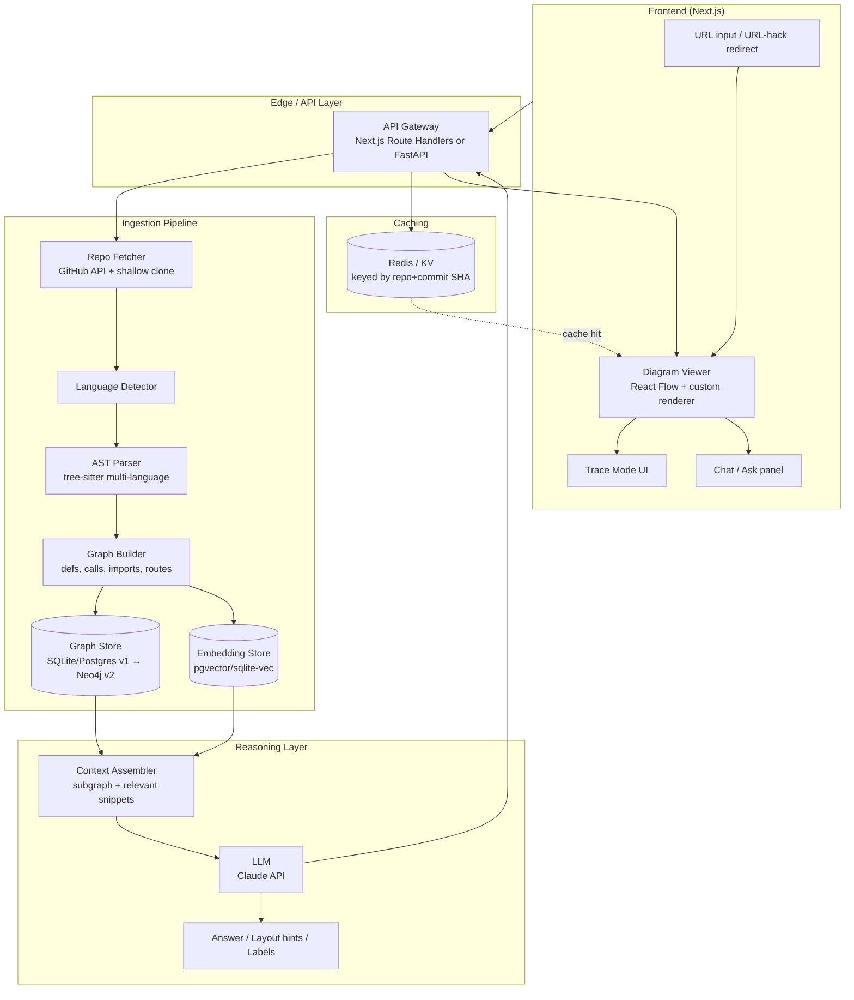

# TraceMap
### Real call graphs for any repository — accurate, not hallucinated.

> Working name: **TraceMap** (alt candidates: CodeAtlas, TraceGraph, Wayfinder — check GitHub/npm/domain availability before committing)

---

## 1. Executive Summary

**One-line pitch:** Paste a GitHub URL, get a real, click-to-trace call graph in seconds — built from actual AST/static analysis, not an LLM's guess at your architecture.

**The wedge:** Tools like GitDiagram (13.9k+ stars) proved there's massive appetite for "paste a repo URL, get an instant architecture diagram." But GitDiagram's diagrams are generated by feeding a file tree + README to an LLM and asking it to imagine a diagram — it's often wrong on non-trivial repos because it never actually parses the code. TraceMap does the harder, more valuable thing: parse the real AST, build a real call/reference graph, and let the LLM layer sit on top of *verified structure* instead of substituting for it.

**Why now:** Codebase-understanding tools are one of the hottest categories in dev tooling (AI coding agents, onboarding tools, architecture visualizers). The gap between "looks like a diagram" and "is actually correct" is wide open and under-served.

**Path to virality → depth:** Ship an extremely low-friction, visually satisfying MVP first (this is what gets stars, Show HN front page, and Twitter GIFs). Only after that traction lands do we build toward the deeper original vision — multi-service tracing, event/message-bus stitching, knowledge-graph backed reasoning — which becomes the retention and enterprise layer.

---

## 2. Problem Statement

New contributors and engineers inheriting legacy systems lose days just answering "where does this go, and what touches this if I change it?" Existing solutions fall into two failure modes:

| Approach | Failure mode |
|---|---|
| Grep / manual file-jumping | Doesn't scale past a few thousand files; no persistent mental model |
| Outdated wikis / docs | Rot within weeks; nobody maintains them |
| Pure LLM-summarized diagrams (GitDiagram-style) | Fast and pretty, but frequently wrong — the model never actually reads the call graph, it pattern-matches file names and README prose |
| Full enterprise code-intelligence platforms (Sourcegraph-style, or CodeMonk's original scope) | Powerful but heavy: require infra (Kafka, Neo4j, multi-agent orchestration) before a user sees any value — wrong first experience for organic/viral growth |

**TraceMap's answer:** structural ground-truth (real parsing) + instant, zero-install UX + a single unmistakable "wow" interaction (trace a request path and watch it light up across the codebase).

---

## 3. Differentiation Matrix

| Capability | GitDiagram | TraceMap v1 | TraceMap v2+ |
|---|---|---|---|
| Zero-install, paste-URL UX | ✅ | ✅ | ✅ |
| Diagram source of truth | LLM guess from file tree + README | Real AST-derived call graph | Real AST + cross-service contracts |
| Click-to-trace an actual call path | ❌ | ✅ | ✅ |
| Natural-language Q&A grounded in real graph | Partial (grounded in README/tree only) | ✅ (grounded in parsed graph) | ✅ + cross-service |
| Multi-repo / microservice tracing | ❌ | ❌ | ✅ |
| Message bus / event contract stitching (Kafka producer↔consumer) | ❌ | ❌ | ✅ |
| CI bot: auto-updated diagram on PR | ❌ | ❌ | ✅ |
| IDE integration | ❌ | Stretch goal | ✅ |

---

## 4. High-Level Architecture



### Component responsibilities

1. **Repo Fetcher** — shallow-clones (depth 1) or uses GitHub's tree/contents API for small repos; enforces size/file-count limits for the free tier.
2. **AST Parser (tree-sitter)** — language-agnostic parsing; extracts function/class/module definitions, call sites, imports, and (for web frameworks) route decorators/handlers.
3. **Graph Builder** — turns raw AST facts into a typed graph: `Module → Function → Calls → Function`, `Route → Handler`, `Class → Method`, `Import → Module`.
4. **Graph Store** — v1: SQLite per-repo snapshot (simple, fast, disposable, cacheable by commit SHA). v2: Neo4j once cross-repo/service relationships need real graph traversal at scale.
5. **Embedding Store** — vector index over function/file summaries for semantic search ("find the code that handles refunds") layered on top of the structural graph, not replacing it.
6. **Context Assembler** — given a user question or a diagram-layout task, pulls the *relevant subgraph* (not the whole repo) and hands it to the LLM — this bounds cost and keeps answers grounded.
7. **LLM layer (Claude API)** — used for: (a) natural-language Q&A over the real graph, (b) generating human-readable labels/groupings for diagram nodes, (c) summarizing a traced path in plain English. It is never the source of the graph's structure — only its narrator.
8. **Cache** — keyed on `(repo, commit_sha, language_set)`; repeat visits to a popular repo are instant and free.

---

## 5. Data Model (v1)

```
Repo { id, owner, name, default_branch, last_indexed_sha, size_bucket }

File { id, repo_id, path, language }

Symbol {
  id, file_id, kind [function|class|method|route|module],
  name, signature, start_line, end_line
}

Edge {
  id, from_symbol_id, to_symbol_id,
  kind [calls|imports|extends|implements|handles_route|instantiates],
  confidence  // 1.0 for direct static resolution, lower for dynamic/duck-typed guesses
}

EmbeddingChunk { id, symbol_id, vector, summary_text }
```

`confidence` matters: dynamic languages (Python, JS) have call sites that can't always be statically resolved (duck typing, dynamic imports). TraceMap should visually distinguish **solid edges** (statically proven) from **dashed edges** (best-effort/LLM-assisted inference) — this honesty is itself part of the "accurate, not hallucinated" positioning and should be called out explicitly in the UI legend.

---

## 6. Feature Breakdown by Phase

### Phase 0 — MVP (Weeks 1–4): the viral surface

Goal: something a stranger can try in 20 seconds and want to screenshot.

- [ ] Paste-a-GitHub-URL input, no login required for public repos
- [ ] Support 2 languages at launch: **JavaScript/TypeScript** and **Python** (broadest combined GitHub audience)
- [ ] Real AST parsing via `tree-sitter` → function/class/import/call graph
- [ ] Interactive diagram (React Flow or Mermaid.js), auto-laid-out, zoom/pan
- [ ] Click any node → highlights its direct callers/callees
- [ ] Click any node → jump to the exact line on GitHub
- [ ] Shareable permalink per repo+commit (`tracemap.dev/owner/repo`)
- [ ] Auto-generated OG/social preview image per repo page (critical for Twitter/Discord shares)
- [ ] "Ask about this repo" chat box, answers grounded in the real graph + relevant snippets
- [ ] Solid vs. dashed edge legend (statically proven vs. inferred)
- [ ] Repo size/complexity limits + friendly queueing message for huge monorepos (avoid infra blowup pre-funding)
- [ ] URL-hack distribution trick (e.g. swap the domain in a GitHub URL, or a one-click browser extension) — copy GitDiagram's proven growth mechanic
- [ ] Result caching by commit SHA (Redis or simple KV)

### Phase 1 — The "wow" feature (Weeks 4–7): the screenshot moment

- [ ] **Trace Mode**: pick an entry point (an HTTP route, a CLI command, an exported function) → animate the exact call path lighting up node-by-node across the graph
- [ ] Plain-English trace summary generated by the LLM from the *actual* traced path ("this request hits `AuthMiddleware`, then `UserController.login`, which calls `UserService.verify`…")
- [ ] "What breaks if I change this?" — reverse trace (all callers, transitively) for a selected symbol
- [ ] Public API (rate-limited) for programmatic diagram generation
- [ ] Embeddable architecture badge for README files (à la star-history.com) — free viral distribution surface

### Phase 2 — Depth & the original CodeMonk vision (Months 2–4)

- [ ] Multi-repo workspace: link several repos together as one logical system
- [ ] Cross-service contract stitching: match Kafka/RabbitMQ producer and consumer schemas across services into unified edges ("Service A's `PaymentProcessedEvent` → consumed by Service B, Service C")
- [ ] Migrate graph store to Neo4j for real cross-repo graph traversal at scale
- [ ] GitHub Action / bot: auto-comments an updated architecture diagram on PRs that change structure
- [ ] Expand language support: Java/Kotlin, Go, Rust
- [ ] Fine-tuned/PEFT small model option for teams wanting to self-host without hitting a hosted LLM API (optional, addresses CodeMonk's "model evaluation & fine-tuning" ambitions once there's a real user base asking for it)

### Phase 3 — Ecosystem & monetization (Months 4+)

- [ ] VS Code / JetBrains extension: hover a function, see its live call graph inline
- [ ] Self-hosted Docker Compose bundle for private/internal codebases (enterprise-friendly, mirrors CodeMonk's original enterprise scope)
- [ ] Hosted SaaS tier: private repos, larger repo-size limits, team workspaces, SSO
- [ ] Core tool (public repos, single-repo mode) stays free & MIT-licensed indefinitely — this is the growth engine; never gate it

---

## 7. Tech Stack (lean-first)

| Layer | v1 choice | Why | v2+ upgrade path |
|---|---|---|---|
| Frontend | Next.js + TypeScript + Tailwind | Fast to ship, great SEO for repo pages (important for organic discovery) | unchanged |
| Diagram rendering | React Flow (or Mermaid.js for pure-text fallback) | Interactive, click handlers, good performance at moderate node counts | Custom WebGL renderer only if graphs get huge |
| Backend/API | FastAPI (Python) — pairs naturally with tree-sitter tooling | Simple, async, good typing | Split into microservices only when justified by load |
| AST parsing | `tree-sitter` (+ language grammars) | Multi-language, battle-tested, fast, no full compiler toolchains needed | Add language-server-protocol-based resolution for higher-confidence dynamic-language edges |
| Graph storage | SQLite per repo snapshot | Zero ops overhead, trivially cacheable, fast for single-repo graphs | Neo4j once cross-repo/service graph queries are needed |
| Vector search | sqlite-vec or pgvector | Lightweight, no separate vector DB service needed at MVP scale | Qdrant if embedding volume grows significantly |
| LLM | Claude API (Sonnet-class model) | Strong at grounded reasoning over structured context; keep prompts strictly scoped to retrieved subgraphs | Add local/open-weights option for self-hosted enterprise tier |
| Cache | Redis (or Vercel KV) | Keyed by `repo+commit_sha` | unchanged |
| Hosting | Vercel (frontend) + small VPS/Fly.io (backend + parsing workers) | Cheap, fast to iterate | Move parsing workers to a job queue (e.g. simple worker pool) once concurrency grows |
| Analytics | PostHog or Plausible | Understand which repos/features drive shares | unchanged |

Note: intentionally **no Kafka, no multi-agent orchestration framework, no Neo4j in v1.** Every one of those is real and valuable to the *original* CodeMonk vision, but none of them are visible or valuable to a first-time visitor, and all of them slow down time-to-ship. Earn the right to add that complexity with an actual user base first.

> **Amendment — 2026-10-01 (execution review; original table above preserved as the strategic reference):**
> v1 implementation consolidates the backend to **TypeScript end-to-end** — Next.js route handlers + one Node indexing worker (Fly.io), tree-sitter official Node bindings, `better-sqlite3` + `sqlite-vec`. The v1 column above for **Backend/API, AST parsing, Graph storage, and Vector search** is superseded accordingly, and the §8 structure comment for `apps/api` ("FastAPI backend") reads as "Node/TS API + indexing worker".
> Rationale: for a solo builder, one language eliminates the cross-language type-codegen layer (F0.02), halves the deploy surface (F0.04), and removes a permanent contract-drift failure mode — worth more at v1 scale than Python's parsing ergonomics. Python returns as a Phase 2 option where it genuinely pays (self-hosted fine-tuning adapter, F2.14). Reversible via the execution plan's decision log (Part V.2).

---

## 8. Suggested Repository Structure

```
tracemap/
├── apps/
│   ├── web/                 # Next.js frontend
│   └── api/                 # FastAPI backend (route handlers, orchestration)
├── packages/
│   ├── parser/              # tree-sitter wrappers, per-language extractors
│   ├── graph/                # graph-building logic, typed Edge/Symbol models
│   ├── context-assembler/    # subgraph retrieval for LLM prompts
│   └── shared-types/         # TS/Pydantic shared schema definitions
├── infra/
│   ├── docker-compose.yml    # self-host bundle (Phase 3)
│   └── github-action/        # PR-diagram-bot (Phase 2)
├── docs/
│   └── ARCHITECTURE.md       # this document, kept in sync
└── README.md                 # GIF-first, zero-jargon, "try it in 20s"
```

---

## 9. Roadmap & Timeline Summary

| Phase | Timeframe | Outcome |
|---|---|---|
| Phase 0 – MVP | Weeks 1–4 | Public launch-ready tool: paste URL → real call graph |
| Phase 1 – Trace Mode | Weeks 4–7 | The signature "wow" feature; Show HN / Product Hunt launch |
| Phase 2 – Depth | Months 2–4 | Multi-service tracing, PR bot, more languages |
| Phase 3 – Ecosystem | Months 4+ | IDE extension, self-host bundle, hosted SaaS tier |

---

## 10. Launch & Growth Plan

1. **README first.** Lead with an animated GIF of Trace Mode above the fold. No architecture-diagram jargon in the first three lines — show, don't tell.
2. **Comparison framing.** A short, factual "TraceMap vs. GitDiagram vs. grep" section emphasizing *accuracy* (solid vs. dashed edges) as the core differentiator — this framing is naturally shareable and debate-generating.
3. **Coordinated launch.** Ship Show HN and Product Hunt on the same day; have 3–5 well-known OSS repos pre-indexed and linked as live demos (pick repos people recognize — e.g. a popular Express or Flask app).
4. **Embeddable badge.** Ship the README badge/embed early — every project that embeds it is free, compounding distribution.
5. **URL hack.** Get the domain-swap trick working and mention it explicitly in the README's first paragraph, exactly as GitDiagram does.
6. **License:** MIT, explicit from day one — reduces friction for stars, forks, and embeds.

---

## 11. Key Risks & Mitigations

| Risk | Mitigation |
|---|---|
| Large monorepos time out or blow up compute costs | Hard size/file-count caps on free tier; async job + progress UI for large repos; queue system |
| Dynamic-language calls can't be statically resolved (Python/JS) | Explicit confidence scoring + dashed-edge UI; never silently guess and present it as fact |
| LLM cost scaling with popularity | Context assembler strictly bounds prompt size to retrieved subgraph; aggressive caching by commit SHA |
| Cloned virality mechanic (URL hack) gets copied by competitors | Fine — the real moat is parsing accuracy and Trace Mode, not the URL trick itself |
| Scope creep back toward "CodeMonk heavy" before traction | Enforce the phase gate: Phase 2 infra (Neo4j, Kafka stitching) does not start until Phase 0/1 metrics (stars, WAU, shares) hit target thresholds |

---

## 12. Success Metrics (first 90 days)

- GitHub stars: target 2,000+ in first month post-launch (GitDiagram-comparable trajectory)
- Time-to-first-diagram for a new visitor: < 30 seconds
- % of visitors who use Trace Mode at least once: target > 40%
- README badge embeds: track weekly growth as a distribution proxy
- Show HN / Product Hunt front-page placement on launch day
